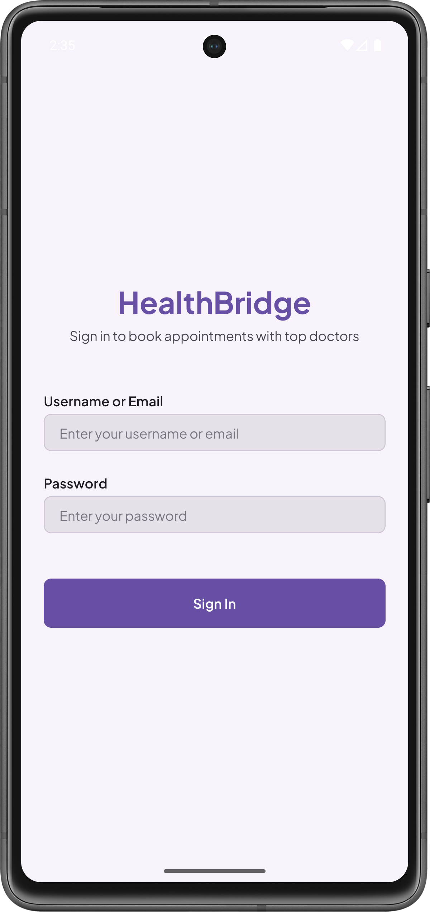
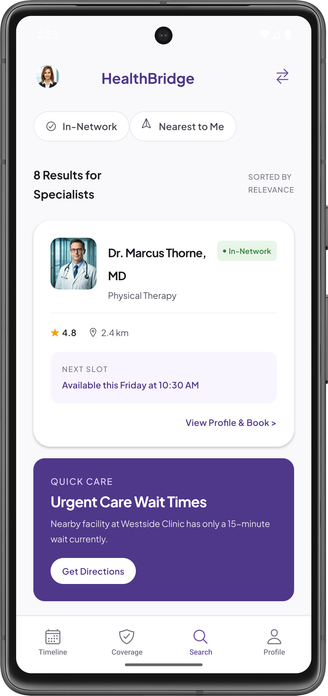
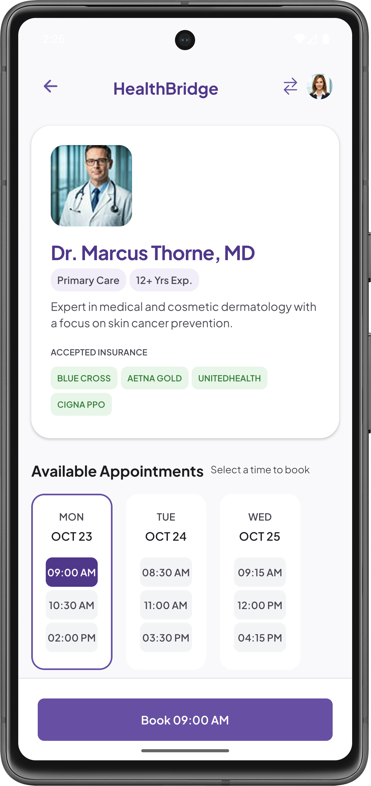
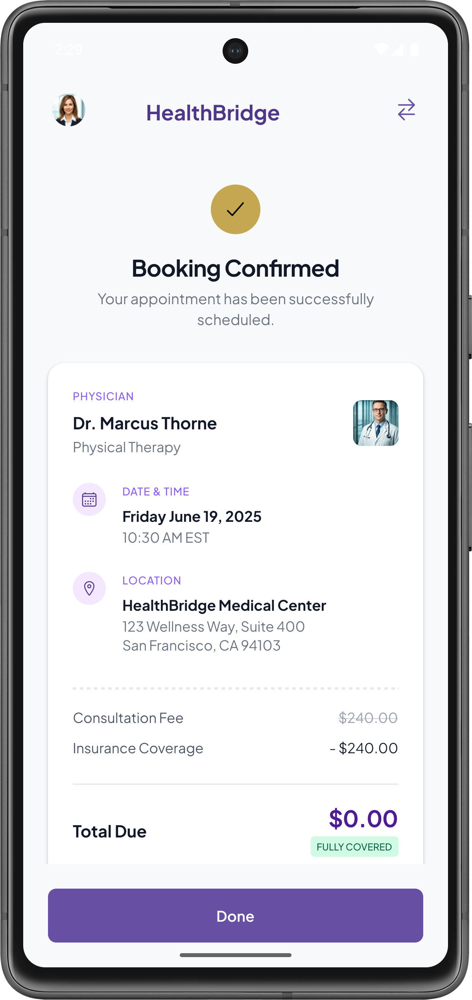
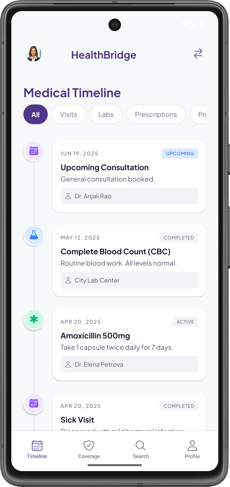
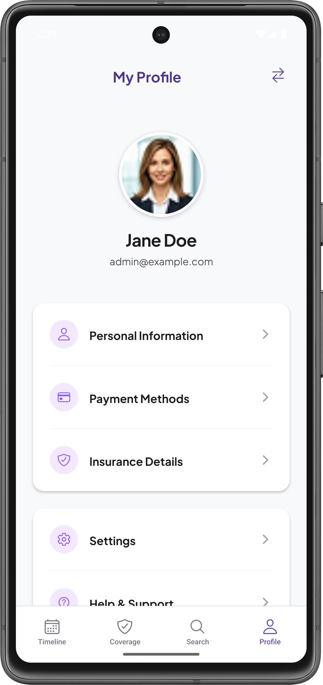

# HealthBridge React Native Assignment

This repository contains the complete source code for the HealthBridge React Native assignment. The application was built from scratch to closely match the provided Figma design, demonstrating strong UI implementation skills, component-based architecture, and React Navigation.

## 🚀 Features & Screens Implemented
- **Login Screen:** Custom designed screen that authenticates users against local JSON data.
- **Home Screen:** Displays a searchable, filterable list of doctors pulled from a local JSON dataset. Accurately recreates the provided UI, including dynamic chips and styling.
- **About Doctor Screen:** A detailed view of a selected doctor. Includes a custom functional map integration and a dynamic "Book Appointment" flow that activates upon time slot selection.
- **Appointment Confirmation Screen:** Matches the receipt design from Figma exactly.
- **Medical Timeline (Profile):** A completely custom-built screen acting as the user's chronological medical history, featuring dynamic data filtering and a beautiful vertical timeline UI.

## 📸 Screenshots

<p align="center">
  
  
  
  
  
  
</p>

## 🛠️ Tech Stack & Libraries
- **React Native** (Functional Components, Hooks)
- **@react-navigation/native** & **@react-navigation/native-stack** & **@react-navigation/bottom-tabs** for complete app navigation.
- **react-native-vector-icons** (Ionicons) for all scalable vector iconography.
- **@react-native-async-storage/async-storage** for persisting the user session.

## 📂 Project Structure
```text
src/
├── components/   # Reusable UI components (ScreenHeader, PrimaryButton, DoctorCard)
├── context/      # React Context (AuthContext for user state management)
├── data/         # Local JSON datasets (users.json, doctors.json, timeline.json)
├── navigation/   # Stack and Tab navigation configurations
├── screens/      # Individual application screens and their isolated styles
└── theme/        # Centralized theme tokens (colors, spacing, typography)
```

## 📝 Assumptions Made During Development
1. **Login Design:** Since the Login screen was not included in the Figma, it was designed to match the app's premium aesthetic (purple/white color scheme) using the provided design system tokens.
2. **Timeline Screen:** The bottom navigation bar included a calendar icon. This was interpreted and fully implemented as a "Medical Timeline" screen to display the patient's past and upcoming events.
3. **Booking Flow:** Instead of navigating instantly upon tapping a time slot on the About Doctor screen, a floating "Book Appointment" footer was added to confirm the user's choice, preventing accidental navigation.
4. **Icons & Assets:** Placeholder assets and vector icons were used in place of proprietary assets, styled to match the mockups as closely as possible.

## 💻 Getting Started

### Prerequisites
- Node.js
- Android Studio / Android Emulator

### Installation
1. Clone the repository
2. Install dependencies:
   ```bash
   npm install
   ```
3. Run the application:
   ```bash
   npm start
   # In a separate terminal or by pressing 'a' in the Metro bundler:
   npm run android
   ```

## 📱 Testing the APK
A pre-built Release APK is available for testing on an Android device or emulator. The generated APK can be found at `android/app/build/outputs/apk/release/`.
